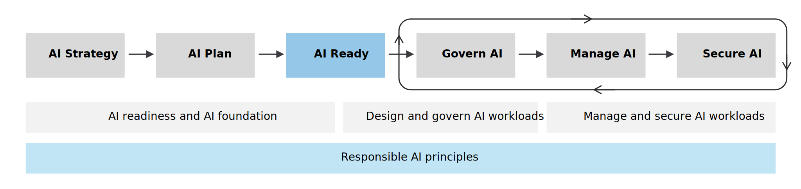

# AI Adoption Workshop 🤖

## Overview 🎯
A comprehensive one-day workshop designed to guide organizations through the essential aspects of AI adoption, from strategy development to practical implementation.

## Duration ⏱️
6 hours (excluding breaks)

## Detailed Agenda 📋

### 1. Introduction to AI Adoption (30 minutes) 🌟
- Overview of the six-step AI adoption process
- Importance of AI for organizations

### 2. AI Strategy Development (60 minutes) 💡
- Creating an AI center of excellence (AI CoE)
- Identifying AI use cases
- Enhancing individual efficiency and improving business processes
- Setting AI targets (goals, objectives, and success metrics)

### 3. AI Technology Strategy (45 minutes) 🔧
- Overview of Microsoft AI solutions (SaaS, PaaS, IaaS)
- AI decision tree exercise
- Factors to consider: skills, data readiness, and budget

### 4. Break (15 minutes) ☕

### 5. AI Data Strategy (45 minutes) 📊
- Importance of data in AI adoption
- Establishing data governance
- Planning the data lifecycle

### 6. AI Planning and Readiness (45 minutes) 📝
- Assessing and acquiring AI skills
- Prioritizing AI use cases
- Creating AI proof of concepts
- Building an AI environment

### 7. Governing, Managing, and Securing AI (60 minutes) 🔒
- Enforcing AI governance policies
- Managing AI models, costs, and operations
- Implementing AI security controls

### 8. Hands-on Exercise: AI Use Case Development (45 minutes) 👥
- Group work on developing AI use cases
- Practical application of workshop concepts
- Organization-specific scenarios

### 9. Conclusion and Q&A (15 minutes) ✨
- Key points recap
- Next steps discussion
- Open Q&A session

## What to Bring 💼
- Laptop
- Business challenges to discuss
- Team collaboration mindset

## Expected Outcomes 🎉
- Understanding of AI adoption framework
- Initial AI strategy outline
- Practical use case development experience
- Action items for implementation

## Prerequisites 📚
- Basic understanding of organizational processes
- Familiarity with business operations
- No technical AI knowledge required

---
*This workshop is designed to be interactive and hands-on. Participants are encouraged to actively engage in discussions and exercises.*